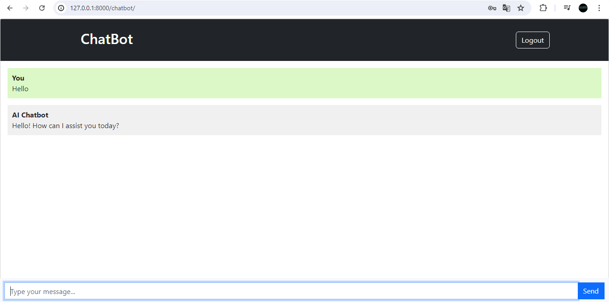

# ChatGPT Clone

## Table of Contents
- [ChatGPT Clone](#chatgpt-clone)
  - [Table of Contents](#table-of-contents)
  - [Project Description](#project-description)
  - [Features](#features)
  - [Technologies Used](#technologies-used)
  - [Prerequisites](#prerequisites)
  - [Installation](#installation)
  - [Usage](#usage)
  - [Screenshots](#screenshots)
  - [Contact](#contact)


## Project Description
**ChatGPT Clone** is a Django-based web application that allows users to interact with a helpful assistant powered by OpenAI. The project includes user registration, login, and chat history features.

## Features

- Chat with an AI assistant powered by OpenAI
- User registration and login
- Chat history

## Technologies Used

- Django
- OpenAI API

## Prerequisites

Ensure you have the following installed:

- Python 3.8+
- The required Python libraries listed in `requirements.txt`
- OpenAI API Key
- Django security key

## Installation

1. **Clone the repository:**
   ```bash
   git clone https://github.com/shevchenkkko/ChatGPT-Clone.git
2. **Create and activate a virtual environment**
     ```bash
    python -m venv venv
    source venv/bin/activate   # On Windows use `venv\Scripts\activate`
3. **Install the dependencies**
   ```bash
   pip install -r requirements.txt
4. **Set up the environment variables:**
    - Create a `.env` file in the root directory and add the following variables:
      ```env
      SECRET_KEY=your_secret_key
      DEBUG=True  # or False in production
      OPENAI_API_KEY=your_openai_api_key
      ```
    - To generate a `SECRET_KEY`, you can use [Django Secret Key Generator](https://djecrety.ir/)
    -  Ensure you have sufficient balance on your OpenAI account.
5. **Apply the migrations:**
    ```bash
    python manage.py makemigrations
    python manage.py migrate
    ```
6. **Run the development server**
   ```bash
   python manage.py runserver

## Usage 
+ *Access the application:*
Open your web browser and go to http://127.0.0.1:8000.
+ *Register an account:*
Login or create a new account to start chatting with the assistant.
+ *Chat with the assistant:*
Start a conversation with the AI assistant and view your chat history.

## Screenshots


## Contact 
For more projects, visit my [GitHub](https://github.com/shevchenkkko)